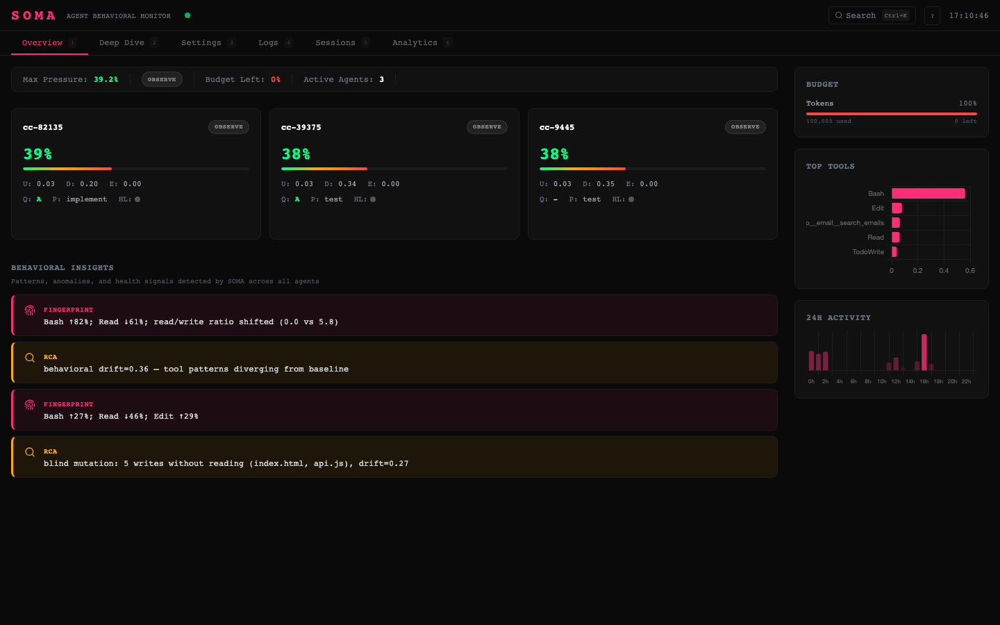
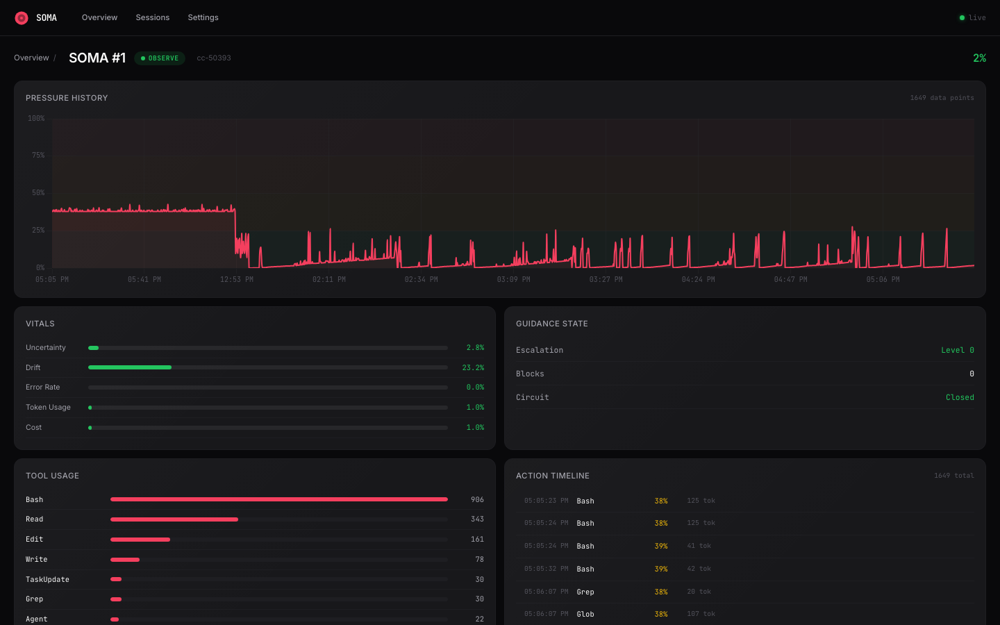
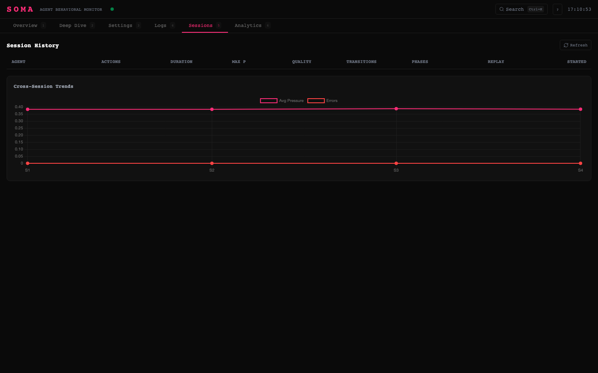
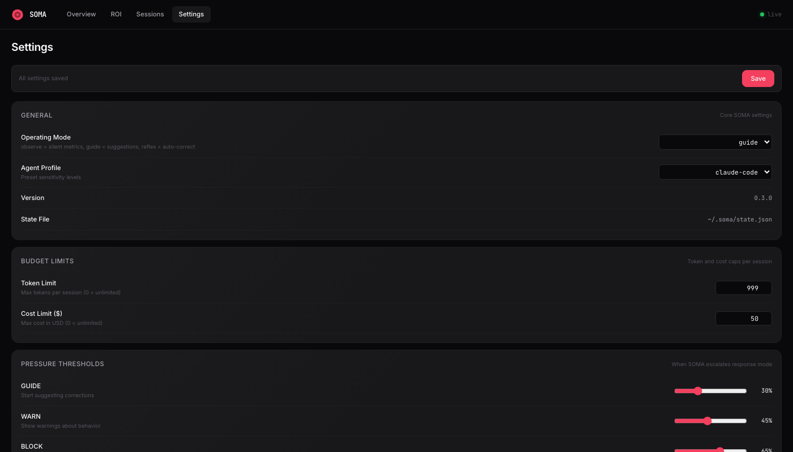

<p align="center">
  
</p>

# SOMA -- The Nervous System for AI Agents

Proprioceptive behavioral monitoring -- agents that feel themselves.

SOMA is a real-time behavioral monitoring system that gives AI agents awareness of their own state. It intercepts every tool call, computes behavioral pressure from 11 vital signals, detects failure patterns, enforces safety reflexes, and injects self-awareness directly into the agent's environment. Think of it as a nervous system: sensing, reacting, learning, remembering -- so agents can self-correct before problems escalate.

```
pip install soma-ai
```

## Dashboard

Real-time web dashboard for monitoring, analyzing, and configuring SOMA.

```bash
soma dashboard          # launch at http://127.0.0.1:7777
soma dashboard --port 8080  # custom port
```

**Overview** -- guidance rate, error rate, pressure trends, mode distribution, active agents with live indicators, token budget, signal averages, recent sessions.

<p align="center">
  
</p>

<details>
<summary>More pages</summary>

**Agent Detail** -- pressure history chart, vitals with baselines, guidance state, tool usage, action timeline with timestamps.


**Sessions** -- all sessions with pressure, mode badges, action counts. Click any session for tool breakdown chart, action timeline, and CSV/JSON export.


**Settings** -- grouped controls with toggles, sliders, and dropdowns. Mode, thresholds, budget, signal weights, guidance, all hook features.


</details>

Features: WebSocket live updates, SPA deep linking (`/agents/{id}`, `/sessions/{id}`), responsive grid, Preact + HTM (no build step).

Requires: `pip install soma-ai[dashboard]`

## Who is this for

- **AI engineers** building agent systems who want observability beyond logs
- **Teams deploying agents in production** who need safety rails without babysitting
- **Researchers** studying agent reliability, failure patterns, and self-correction
- **Anyone using Claude Code** who wants their agent to stop retrying the same failing command

SOMA works today as a Claude Code hook system. The core is platform-agnostic -- SDK adapters exist for LangChain, CrewAI, AutoGen, and any Anthropic API client. Hook adapters also exist for Cursor and Windsurf.

## The problem

AI agents are blind to their own behavior. They retry the same failing command five times. They edit files they never read. Their error rate climbs for ten actions straight and they don't notice.

This isn't anecdotal:
- **41-86% failure rate** across agent benchmarks (MAST, Berkeley NeurIPS 2025)
- **Reliability lags capability by 2-3x** (Kapoor et al., Princeton 2026)
- Agents degrade predictably -- error cascades, retry loops, scope drift -- but have no signal to self-correct

Every existing tool monitors agents *externally for humans*. Dashboards and alerts for the operator. The agent itself never sees the data.

**SOMA's key insight:** LLMs ignore instructions but cannot ignore environmental data. Embed behavioral telemetry into tool responses and the agent processes it like any other fact about the world.

## What SOMA does

### Behavioral Sensing

11 real-time vital signals computed per action:

| Signal | What it measures |
|--------|-----------------|
| Uncertainty | Epistemic vs aleatoric -- does the agent know what it doesn't know? |
| Drift | Behavioral deviation from established baseline (phase-aware) |
| Error rate | Rolling error frequency with pattern weighting |
| Entropy | Action distribution disorder -- are tool choices becoming random? |
| Goal coherence | Is the agent still working toward its objective? |
| Token usage | Consumption rate and acceleration |
| Cost | Spend rate per action and cumulative |
| Context burn rate | How fast is the context window being consumed? |
| Half-life | Estimated actions until the agent becomes ineffective |
| Calibration | How well do confidence signals predict actual outcomes? |
| Verbal-behavioral divergence | Does the agent say one thing and do another? |

All signals feed into **Pressure** -- a unified 0-to-1 metric aggregated via sigmoid z-scores with configurable blending (mean + max). EMA baselines with cold-start blending prevent false positives in early sessions.

### Pattern Detection

Real-time detection of known failure modes:

- **Blind edits** -- writing to files never read (the #1 agent anti-pattern)
- **Retry storms** -- same failing command repeated 3+ times
- **Bash failure cascades** -- error rate > 40% with dedup detection
- **Thrashing** -- editing the same file 3+ times without progress
- **Research stall** -- reading without acting, context burning without output
- **Quality grading** -- A/B/C/D/F based on syntax errors, lint issues, bash failures

### Reflex System

Hard safety blocks that fire before the tool executes:

- **Destructive operation blocks** -- `rm -rf`, `git push --force`, `DROP TABLE`
- **Commit gate** -- blocks `git commit` when quality grade is D or F
- **Circuit breaker** -- halts cascading failures after threshold
- **Retry dedup** -- prevents identical failing commands from re-executing
- **Blind write prevention** -- warns on file edits without prior read

Reflexes operate independently from pressure. They fire at any pressure level when the specific pattern is detected.

### Mirror

Proprioceptive feedback via environment augmentation -- the agent sees its own state as facts in tool responses.

| Mode | Cost | When | What the agent sees |
|------|------|------|---------------------|
| PATTERN | $0 | Known behavioral pattern | `pattern: same bash cmd repeated 5x` |
| STATS | $0 | Elevated pressure, no pattern | `errors: 3/8 \| error_rate: 0.41` |
| SEMANTIC | ~$0.001 | High pressure + drift | LLM-generated behavioral observation |

Mirror learns from outcomes. After each injection, it watches the next 3 actions. If pressure drops >=10%, the pattern helped and gets cached. Ineffective patterns are pruned after 5 failures.

### Multi-Agent Intelligence

- **PressureGraph** -- directed graph modeling inter-agent dependencies with trust-weighted edges and damping-based pressure propagation
- **Subagent monitoring** -- tracks spawned child agents, their tool usage, error rates, and token consumption
- **Cascade risk detection** -- when a subagent's error rate crosses threshold, risk propagates to parent pressure
- **Coordination SNR** -- signal-to-noise ratio per agent in multi-agent workflows

### Cross-Session Memory

SOMA remembers across sessions:

- **Behavioral fingerprinting** -- tool distribution, error baselines, read/write ratios tracked via Jensen-Shannon divergence. Detects when an agent's behavior shifts from its historical norm
- **Session history** -- append-only JSONL log of every session (pressure trajectories, mode transitions, tool distributions, phase sequences)
- **Cross-session predictor** -- matches current trajectory against historical patterns (cosine similarity) to predict escalations before they happen
- **Learned pattern database** -- effective Mirror patterns cached and reused; ineffective ones pruned

### Budget and Resource Tracking

- **Token and cost tracking** with configurable limits per dimension
- **Burn rate estimation** -- tokens/action and cost/action with trend detection
- **Half-life estimation** -- predicts when the agent will become ineffective based on context consumption
- **Budget exhaustion blocking** -- stops API calls when budget is spent
- **Handoff suggestions** -- recommends human takeover when half-life is critical

### Predictions and Forecasting

- **Linear trend extrapolation** from recent pressure window
- **Pattern-based boosts** -- error streaks (+0.15), blind writes (+0.10), thrashing (+0.08), retry storms (+0.12) added to predicted pressure
- **Cross-session trajectory matching** -- blends 60% current trend + 40% historical pattern match
- **Confidence scoring** via R-squared on trend fit
- **Escalation warnings** -- predicts threshold crossings N actions ahead

## Quick start

```bash
pip install soma-ai
```

Configure Claude Code hooks automatically:

```bash
soma setup-claude
```

Or add hooks manually to `~/.claude/settings.json`:

```json
{
  "hooks": {
    "PreToolUse": [{ "type": "command", "command": "soma-hook" }],
    "PostToolUse": [{ "type": "command", "command": "soma-hook" }],
    "Stop": [{ "type": "command", "command": "soma-hook" }]
  }
}
```

SOMA is silent when the agent is healthy. When behavioral pressure rises above 15%, session context appears in tool responses.

For semantic mode (optional): `export GEMINI_API_KEY=...` (free tier).

See [docs/QUICKSTART.md](docs/QUICKSTART.md) for the full setup guide.

## Programmatic API

```python
import soma

# Quick start -- creates engine with defaults
engine = soma.quickstart()

# Wrap any Anthropic client -- all calls monitored transparently
client = soma.wrap(anthropic.Anthropic())

# Universal proxy for any framework (LangChain, CrewAI, custom)
proxy = soma.SOMAProxy(engine, "my-agent")
safe_tool = proxy.wrap_tool(my_function)
child = proxy.spawn_subagent("child-agent")

# Replay and analyze past sessions
soma.replay_session("~/.soma/sessions/recording.json")
```

## Architecture

```
Tool Call ─────────────────────────────────────────────> Tool Execution
     │                                                         │
     v                                                         v
+- SOMA Engine ────────────────────────────────────────────────────+
│                                                                   │
│  PRE-TOOL (before execution)          POST-TOOL (after execution) │
│  +──────────────+                     +──────────────────+        │
│  │   Skeleton   │ hard blocks,        │  Sensor Layer    │        │
│  │   (Reflexes) │ retry dedup,        │  11 vitals ->    │        │
│  │              │ blind write warn    │  EMA baselines ->│        │
│  +──────────────+                     │  pressure (0->1) │        │
│                                       +────────┬─────────+        │
│                                                │                  │
│                                       +────────v─────────+        │
│                                       │ Pattern Detection │       │
│                                       │ retry, thrash,    │       │
│                                       │ blind edit, stall │       │
│                                       +────────┬─────────+        │
│                                                │                  │
│                                       +────────v─────────+        │
│                                       │     Mirror        │       │
│                                       │ PATTERN -> STATS  │       │
│                                       │ -> SEMANTIC       │       │
│                                       │ (-> tool response)│       │
│                                       +────────┬─────────+        │
│                                                │                  │
│  +──────────────+                     +────────v─────────+        │
│  │ PressureGraph│<────────────────────│   Multi-Agent    │        │
│  │ (propagation)│ trust-weighted      │   Coordination   │        │
│  +──────────────+ edges               +──────────────────+        │
│                                                                   │
│  +────────────────────────────────────────────────────────+       │
│  │ Memory: fingerprints | sessions | patterns | predictor │       │
│  +────────────────────────────────────────────────────────+       │
+───────────────────────────────────────────────────────────────────+

Escalation: OBSERVE (silent) -> GUIDE (suggestions) -> WARN (insistent) -> BLOCK (destructive ops only)
Delivery:   stdout -> tool response (agent sees)  |  stderr -> system diagnostics (operator sees)
```

## Integrations

| Platform | Method | Status |
|----------|--------|--------|
| Claude Code | Hook system (pre/post tool use, stop, notification) | Production |
| Anthropic API | `soma.wrap(client)` -- transparent proxy | Production |
| Any framework | `soma.SOMAProxy` -- universal tool wrapper | Production |
| LangChain | SDK adapter with callback handler | Adapter ready |
| CrewAI | SDK adapter with tool decorator | Adapter ready |
| AutoGen | SDK adapter with agent wrapper | Adapter ready |
| Cursor | Hook adapter (`CursorAdapter`) | Adapter ready |
| Windsurf | Hook adapter (`WindsurfAdapter`) | Adapter ready |
| OpenTelemetry | Metrics export (gauges, counters) | Optional extra |
| Webhooks | Fire-and-forget HTTP on WARN/BLOCK events | Built-in |

## Research foundation

SOMA addresses gaps identified in recent agent reliability research:

| Paper | Finding | SOMA response |
|-------|---------|---------------|
| Kapoor et al. (Princeton 2026) | Reliability lags capability 2-3x | Real-time behavioral feedback |
| MAST (Berkeley NeurIPS 2025) | 41-86% failure, error cascades | Pattern detection + pressure signal |
| METR (2025) | Silent failures, no self-correction | Proprioceptive session context |
| Anthropic (2025) | Tool errors propagate unchecked | Pre/post tool use interception |

All prior work measures behavior *post-hoc for human review*. SOMA provides *real-time proprioceptive feedback to the agent itself*.

See [docs/RESEARCH.md](docs/RESEARCH.md) for the full research mapping.

## v0.6.0 highlights

**Mirror** -- proprioceptive feedback via environment augmentation. Three escalation modes (PATTERN -> STATS -> SEMANTIC), self-learning from outcomes, zero-cost for pattern/stats modes. **Web dashboard** -- real-time FastAPI + SSE dashboard on port 7777 with 6 tabs (Overview, Deep Dive, Analytics, Logs, Sessions, Settings). See [CHANGELOG.md](CHANGELOG.md) for full history.

## Stats

90 modules | 74 test files | 19k lines | Python 3.11+ | MIT license

## Links

- [Quick Start](docs/QUICKSTART.md) | [Architecture](docs/ARCHITECTURE.md) | [Research](docs/RESEARCH.md)
- [Changelog](CHANGELOG.md) | [PyPI](https://pypi.org/project/soma-ai/)
