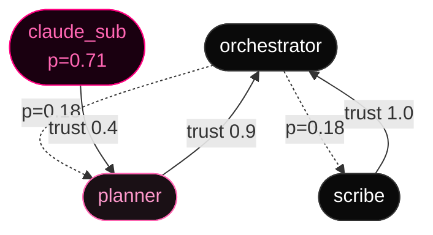
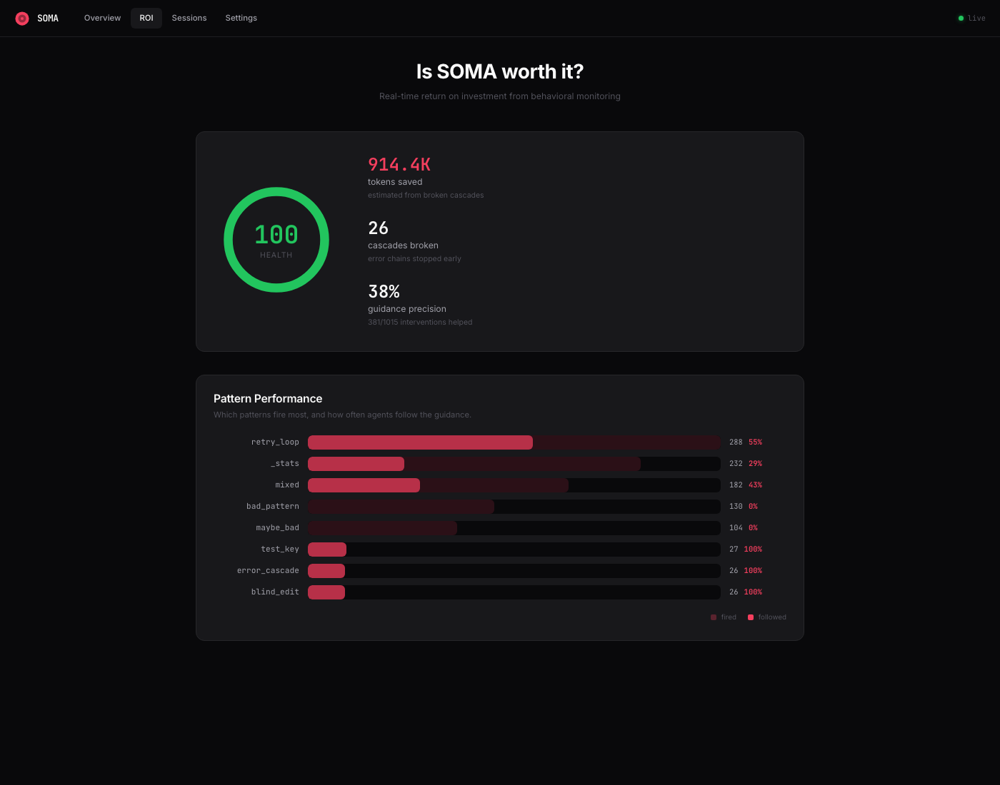

<div align="center">


# SOMA

### *A nervous system for autonomous LLM agents.*

**Most AI-safety tooling grades the transcript *after* the agent finishes.<br>
SOMA changes the transcript *while* the agent is writing it.**

<br>

[](https://pypi.org/project/soma-ai/)
[](https://pypi.org/project/soma-ai/)
[](LICENSE)

<br>

```
 18,106  ─  agent actions
    505  ─  sessions
    313  ─  guidance firings
     85  ─  A/B outcomes
```

<sub>All numbers from continuous production use on my own Claude Code workflow.</sub>

</div>

---

I built SOMA to monitor LLM agents the way `htop` monitors processes — continuous, in-process, with a feedback loop. Five vital signs derived from the action stream collapse into a single pressure scalar; once that scalar crosses a threshold, corrective guidance is injected straight into the agent's next-turn context.

```python
import soma, anthropic

client = soma.wrap(anthropic.Anthropic())
client.messages.create(...)   # SOMA observes, scores, intervenes.
```

> [!TIP]
> Already on Claude Code? `pip install soma-ai && soma init` wires the hooks into `.claude/settings.json`. Zero code changes.

<br>

<p align="center">
  
  <br>
  <sub><i>The live dashboard. Open with <code>soma dashboard</code>.</i></sub>
</p>

---

## How it works

### Five vital signs → one pressure

Each action updates a per-signal exponential moving average per agent. Cold-start blending keeps the first few actions in a session from triggering false positives.

| Signal         | What it captures                                |
|----------------|-------------------------------------------------|
| `uncertainty`  | hedge density and semantic hesitation in output |
| `drift`        | divergence from the session intent vector       |
| `error_rate`   | windowed tool-call failure ratio                |
| `token_usage`  | tokens-per-action velocity                      |
| `cost`         | dollars-per-action velocity                     |

Each raw signal is normalized into a per-signal pressure through a **shifted, clamped sigmoid**:

```math
\text{signal\_pressure} = \sigma_{clamp}\!\left(\frac{\text{current} - \text{baseline}}{\sigma}\right)
```

```
σ_clamp(x) = 0                  if x ≤ 0
           = 1                  if x > 6
           = 1 / (1 + e^(3−x))  otherwise
```

> The shift by 3 is intentional — a raw z-score around zero shouldn't register pressure. A signal has to be *visibly* above baseline before it counts. `signal_pressure < 0.5` until `z > 3`.

The five aggregate into a single scalar:

```math
\text{pressure} = 0.7 \cdot \overline{\text{signals}} + 0.3 \cdot \max(\text{signals})
```

> Pure mean lets one screaming signal hide behind four calm ones. Pure max over-reacts to a single noisy sensor. The 70/30 blend was tuned on early sessions; the constant should eventually be learned per-agent.

`pressure ∈ [0, 1]` maps to a response mode:

| Range          | Mode      | Behaviour                                     |
|:---------------|:----------|:----------------------------------------------|
| `0.00 – 0.25`  | `OBSERVE` | Silent. Metrics only.                         |
| `0.25 – 0.50`  | `GUIDE`   | Soft course-correction in the agent context.  |
| `0.50 – 0.75`  | `WARN`    | Insistent, blocking-adjacent.                 |
| `0.75 – 1.00`  | `BLOCK`   | Refuse destructive operations.                |

### Pipeline


### Multi-agent — the trust graph

One agent gets one pressure scalar. **A graph of agents gets a propagating one.** When `research` shows distress, the pressure flows to whoever owns it — a planner, an orchestrator, a parent session — across trust-weighted directed edges. The orchestrator reacts to a sub-agent's retry storm even when the sub-agent's transcript never reaches it.



```python
import soma

eng = soma.SOMAEngine()
eng.register_agent("orchestrator")
eng.register_agent("planner")
eng.register_agent("claude_sub")

# Directional edge: when source struggles, target picks up a fraction.
eng.add_edge("claude_sub", "planner", trust_weight=0.4)
eng.add_edge("planner",    "orchestrator", trust_weight=0.9)
```

`trust_weight ∈ [0, 1]` controls how much pressure leaks per propagation step. Three damping iterations converge fast and never amplify — cycles decay rather than oscillate. The whole reason SOMA isn't *just* a single-session monitor: real agentic systems are ensembles, and one sub-agent retry-storming inside a sub-task should be a signal the parent acts on, not noise lost in a tree.

---

## Guidance — experimental, in active testing

> [!IMPORTANT]
> The vitals pipeline is **stable**. The intervention layer on top of it is **a live experiment**.
> Patterns are instrumented end-to-end so I can tell whether a message *changed* agent behaviour or only *correlated* with a change that was already happening.

Six patterns ship today:

| Pattern              |   n  | Status                                           |
|:---------------------|-----:|:-------------------------------------------------|
| `bash_retry`         |   60 | Highest-volume — `collecting`                    |
| `budget`             |   56 | `collecting`                                     |
| `blind_edit`         |   55 | `collecting`                                     |
| `bash_error_streak`  |    2 | New — sampling                                   |
| `cost_spiral`        |    1 | New — sampling                                   |
| `error_cascade`      |    0 | Active — awaiting first firing                   |

`bash_retry` is the highest-volume pattern: 55 of 60 treatment firings (91.7 %, Wilson 95 % CI [82, 96]) end with pressure below the firing-time baseline at the next action. That is a *descriptive* recovery rate — not a treatment effect. The matched A/B comparison hasn't yet produced a verdict for any pattern: every row above is status `collecting` until the gate clears. The methodology, not the verdict, is what's stable today.

### What got retired

Three patterns that shipped earlier no longer fire. Listing them publicly because the methodology only matters if the gate works in both directions:

| Pattern         | Why retired                                                             |
|:----------------|:------------------------------------------------------------------------|
| `entropy_drop`  | Vitals signal kept; guidance message under-helped on outcome data.      |
| `context`       | Wrong abstraction — too vague to produce actionable healing.            |
| `drift`         | Detector too noisy without per-agent calibration. Vitals signal kept.   |

Killing a pattern uses the same lever as adding one. The bus is governed by data, not author preference.

<details>
<summary><b>How outcomes are measured</b></summary>

<br>

Every active pattern runs **block-randomized A/B**: per-firing assignment to treatment vs. control, randomization keyed on `firing_id` (not `session_id`) so there is no intra-session bleed. Outcomes are recorded at three horizons (`h=1`, `h=5`, `h=10` actions ahead) into a SQLite `ab_outcomes` table.

Release gate per pattern:

```
n ≥ 30 paired observations,
two-tailed test, α = 0.05
```

The methodology is the durable part. Patterns get refined, replaced, or retired as data comes in. The system is built so I can swap a message tomorrow and trust the next thirty firings to tell me whether it worked.

</details>

<br>

<table>
<tr>
<td width="50%"><br><sub align="center"><i>Per-agent detail — vital signs, baselines, pressure history.</i></sub></td>
<td width="50%"><br><sub align="center"><i>Pattern ROI — helped %, pressure delta, sample size per pattern.</i></sub></td>
</tr>
<tr>
<td width="50%"><br><sub align="center"><i>Sessions — per-session pressure timeline and guidance log.</i></sub></td>
<td width="50%"><br><sub align="center"><i>Settings — thresholds, mode boundaries, pattern toggles.</i></sub></td>
</tr>
</table>

---

## Where it fits

**Long-running coding agents.** SOMA was built on my own Claude Code workflow and that's where the production data comes from. Retry storms, blind edits, runaway bash loops — `bash_retry` is the primary signal.

**CI gates for agent behaviour.** `pytest-soma` lets you assert that an agent stays below a pressure threshold on a fixed prompt. Useful for catching prompt regressions before merge.

**Cost containment.** `cost_spiral` and `budget` patterns escalate to BLOCK when token velocity diverges from baseline. Stops the agent before the bill, not after.

**Multi-agent orchestration** *(no production data yet — fleet is one human).* The trust graph propagates pressure across connected agents. See the [Multi-agent](#multi-agent--the-trust-graph) section above.

**Adversarial probing** *(open research direction).* The `drift` signal is sensitive to session-intent divergence, which includes some classes of prompt injection. Unverified — if you're researching this, reach out.

---

## Install

```bash
pip install soma-ai
```

<sub>Python 3.11 / 3.12 / 3.13. No external services required. Optional OpenTelemetry export via `pip install soma-ai[otel]`.</sub>

### Two integration paths

<table>
<tr>
<td valign="top" width="50%">

**Hooks** — zero code, for Claude Code

```bash
soma init      # write hooks into
               # .claude/settings.json

soma status    # live vitals in
               # the terminal
```

</td>
<td valign="top" width="50%">

**SDK wrapper** — any LLM client

```python
import soma, anthropic

client = soma.wrap(
    anthropic.Anthropic(),
    agent_id="research",
)
client.messages.create(...)
```

</td>
</tr>
</table>

`soma status` in the terminal:

```
SOMA — 3 agents monitored

  cc-34596      OBSERVE       p=0.14  u=0.23  d=0.03  e=0.01   #2
  cc-1384       OBSERVE       p=0.16  u=0.23  d=0.05  e=0.01   #2
  cc-63890      OBSERVE       p=0.00  u=0.05  d=0.05  e=0.01   #0

  Budget: 55% (tokens: 552/999)
```

---

## Memory across sessions

**Lessons store.** Errors that get fixed once turn into hints when a similar shape comes back later. Trigram-similarity matching means a `ModuleNotFoundError: pkg_resources` in this session pulls the fix you wrote two weeks ago. On-disk JSON, capped at 100 lessons with LRU eviction.

```python
from soma.lessons import LessonStore

store = LessonStore()
store.record(
    pattern="ModuleNotFound",
    error_text="ModuleNotFoundError: No module named 'pkg_resources'",
    fix_text="pip install setuptools",
    tool="Bash",
)

# Later, in a different session…
store.query("pkg_resources is missing", tool="Bash")
# → [{'similarity': 0.71, 'fix_text': 'pip install setuptools', ...}]
```

**Replay.** Sessions are recorded action-by-action. Replay the recording back into a fresh engine and you get bit-identical pressure trajectories — required for debugging "why did SOMA fire there?" weeks after the fact, and for shipping bias-class regressions as recorded sessions instead of one-off tests.

```bash
soma replay ~/.soma/sessions/2026-04-29.jsonl
```

---

## Auditability

The analytics aren't a black box. They're a SQLite database — `sqlite3 ~/.soma/analytics.db` and audit it yourself.

- **Source tagging.** Every row in `guidance_outcomes` and `ab_outcomes` carries `source ∈ {hook, wrap, test}`. Test-fixture writes are dropped from production stats; replay tooling cannot pollute live data.
- **SQL-trigger invariants.** A `BEFORE INSERT` trigger refuses any `ab_outcomes` row with a NULL `firing_id`. The bias class is enforced by the database, not by Python convention.
- **Audit log.** Rotating JSONL (`~/.soma/audit.*.jsonl`) records every guidance firing, every block, every silent failure. Bounded retention; rotation automatic.
- **Schema migrations.** Engine state and calibration carry a `schema_version` and migrate forward on load. Old state survives breaking math changes.

When a pattern claims to have helped, you can re-derive that claim from raw rows on disk.

---

## Calibration

Per-agent EMA baselines update on every action. Cold-start blending keeps the first ~10 actions of a fresh session from over-reacting — defaults dominate until enough data accumulates.

The math is the same shape across agents; the *constants* aren't. Each agent's baseline drifts toward that agent's own normal. Mode boundaries (`0.25 / 0.50 / 0.75`) and the sigmoid shift (`σ_clamp` shifted by 3) are global today; per-agent thresholds are the next calibration target. A schema-versioned migration framework already ships so future calibration changes don't crash existing engine state.

---

## Observability

Pressure events optionally export to OpenTelemetry. `pip install soma-ai[otel]` adds the exporter; every pressure update, guidance firing, and block decision becomes a span. Plug into Grafana / Prometheus / any OTel collector — agent vitals end up next to service vitals on the same dashboard.

```bash
soma statusline      # one-line vitals, drop in your shell prompt
soma dashboard       # full Textual TUI
soma replay <file>   # deterministic replay of a recorded session
```

---

## What's next

1. **Drive three more patterns to gate** (n ≥ 30 paired). ~3 weeks.
2. **Per-agent calibration** of the 0.7 / 0.3 mean–max blend, the sigmoid shift, and the mode boundaries — each should derive from the agent's own history. Next.
3. **Forecast `cost_spiral`** before the spike. The pattern fires *after* the spike today; the trajectory should predict it. After (2).
4. **A learned aggregator.** Replace the hand-tuned blend with a small online model that adjusts signal weights to per-agent error feedback. Research.

---

<div align="center">

<sub>Built by <a href="https://github.com/tr00x">@tr00x</a> · MIT · CalVer</sub>

</div>
