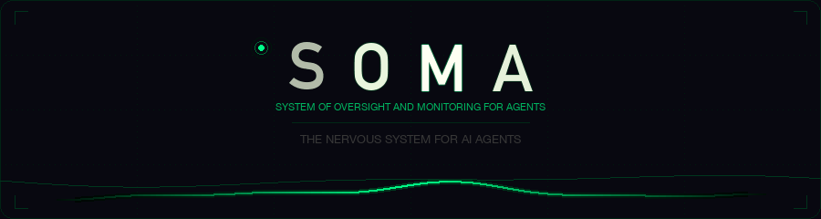

<p align="center">
  
</p>

<h1 align="center">SOMA</h1>

<p align="center">
  <strong>System of Oversight and Monitoring for Agents</strong><br/>
  <em>The nervous system for AI agents.</em><br/>
  Real-time behavioral monitoring. Predictive guidance. Autonomous safety control.
</p>

<p align="center">
  <a href="https://pypi.org/project/soma-ai/"></a>&nbsp;
  <a href="https://pypi.org/project/soma-ai/"></a>&nbsp;
  <a href="https://github.com/tr00x/SOMA-Core/blob/main/LICENSE"></a>&nbsp;
  <a href="#-test-results"></a>
</p>

<p align="center">
  <a href="docs/claude-code-layer.md">Claude Code Layer</a> &bull;
  <a href="docs/PAPER.md">Research Paper</a> &bull;
  <a href="docs/TECHNICAL.md">Technical Reference</a> &bull;
  <a href="docs/guide.md">User Guide</a> &bull;
  <a href="docs/api.md">API Reference</a> &bull;
  <a href="docs/hooks.md">Hook Reference</a> &bull;
  <a href="ROADMAP.md">Roadmap</a>
</p>

---

> **Your AI agent just edited 5 files without reading any of them. It's retrying the same failing command for the 8th time. It wandered from your auth module into unrelated config files. And you have no idea until it's too late.**
>
> SOMA sees all of this in real-time — and steers the agent back on track.

```bash
pip install soma-ai
```

---

## What SOMA Does

SOMA is not a dashboard. It's not a logger. It's a **closed-loop behavioral guidance system** that watches every action an AI agent takes, detects problems as they develop, and **injects corrective feedback directly into the agent's context**.

### Watch → Classify → Guide → Warn → Block (only destructive ops)

| | What | How |
|:--|:-----|:----|
| **Watch** | 5 behavioral signals per action | Uncertainty, drift, error rate, cost, token usage |
| **Classify** | Epistemic vs aleatoric uncertainty | Epistemic (agent lacks knowledge) gets 1.3x pressure; aleatoric (inherently ambiguous) gets 0.7x dampening |
| **Guide** | Injects specific advice into agent context | `"3 writes without a Read — Read the target file first"` |
| **Warn** | Escalating warnings as pressure rises | Insistent guidance with increasing urgency |
| **Block** | Blocks ONLY destructive operations | `rm -rf`, `git push --force`, `.env` writes — never blocks normal tools |
| **Learn** | Adapts thresholds to each agent | Tracks intervention outcomes, tunes over time |
| **Predict** | Warns ~5 actions before escalation | Linear trend + pattern detection (error streaks, thrashing, blind writes) |
| **Predict degradation** | Half-life models warn before failure | Exponential decay modeling predicts probability of success at future action counts |

### What SOMA Catches

These are real messages SOMA injects into the agent's context:

```
[do] Read main.py and config.py before editing — 3 writes without a Read
[do] STOP retrying, try a different approach — 4 consecutive Bash failures
[do] Read the file, plan ALL changes, then make ONE edit — edited app.py 5x
[do] Start writing code — 7 reads, 0 writes in last 10 actions
[do] Verify you're still on track — 15 mutations with no user check-in
[predict] escalation in ~5 actions (error_streak) — stop retrying the failing approach
[scope]   scope expanded to tests/, config/ — is this intentional? If not, refocus
[quality] grade=D (2 syntax errors, 3/8 bash commands failed)
[✓] good — read before writing, clean edits
```

The agent reads these and **changes its behavior**. That's the feedback loop — not a human reading logs after the fact.

---

## Quick Start

<table>
<tr>
<td>

**Claude Code** (zero code)

```bash
uv tool install soma-ai
soma setup-claude
```

That's it. Phase-aware status line appears immediately:

```
SOMA: #42 [implement] ctx=73% focused
```

</td>
<td>

**Python SDK** (any agent)

```python
import anthropic, soma

client = soma.wrap(anthropic.Anthropic())
response = client.messages.create(
    model="claude-sonnet-4-20250514",
    messages=[...],
)
# Every API call is monitored
```

</td>
</tr>
<tr>
<td>

**Framework Adapters**

```python
# LangChain
from soma.sdk.langchain import SomaLangChainCallback
chain.invoke(input, config={"callbacks": [SomaLangChainCallback(engine, "agent")]})

# CrewAI
from soma.sdk.crewai import SomaCrewMiddleware
crew = SomaCrewMiddleware(engine, "crew-agent").wrap(crew)

# AutoGen
from soma.sdk.autogen import SomaAutoGenObserver
agent.register_observer(SomaAutoGenObserver(engine, "autogen-agent"))
```

</td>
<td>

**TypeScript SDK**

```typescript
import { SOMAEngine, track, wrapVercelAI } from "soma-ai";

const engine = new SOMAEngine();
track(engine, "my-agent", { tool: "bash", output: "..." });

// Vercel AI SDK integration
const model = wrapVercelAI(engine, "agent", yourModel);
```

</td>
</tr>
</table>

---

## Why SOMA?

AI agents are powerful but fragile. They loop. They edit files blind. They retry failing commands endlessly. They drift from the task. And in multi-agent pipelines, one confused agent cascades failures across the entire system.

**Existing solutions don't close the loop:**

| Approach | Observes behavior? | Tells the agent? | Guides actions? | Adapts? | Multi-agent? |
|----------|:-:|:-:|:-:|:-:|:-:|
| Guardrails (NeMo, Lakera) | Prompt-level only | No | Content filter | No | No |
| Observability (LangSmith, Helicone) | Yes | **No** | **No** | No | Partial |
| Rate limiters | No | No | Token cap | No | No |
| **SOMA** | **5 signals** | **7 pattern warnings** | **4-mode guidance** | **Self-learning** | **Trust graph** |

---

## The Guidance System

SOMA doesn't just alert. It **guides** — progressively increasing urgency as pressure rises, but never blocking your normal workflow. SOMA is always present — even at low pressure it provides actionable metrics and positive feedback, not silence.

```
  0%          25%         50%           75%          budget=0
  │           │           │             │               │
  ▼           ▼           ▼             ▼               ▼
OBSERVE      GUIDE       WARN         BLOCK          SAFE_MODE
metrics    suggestions  insistent   destructive ops   budget gone
+ [✓]      never blocks never blocks only             read-only
```

| Mode | Pressure | What SOMA Does |
|:-----|:---------|:------------|
| **OBSERVE** | 0-24% | All tools allowed. Status line shows vitals. Actionable metrics: `ctx=73% focus=focused`. Positive feedback: `[✓] good — read before writing`. |
| **GUIDE** | 25-49% | Soft suggestions injected into context. *"Read before every Write/Edit."* Never blocks anything. Workflow-aware — severity suppressed during planning phases. |
| **WARN** | 50-74% | Insistent warnings with increasing urgency. *"Pressure is high — slow down and verify."* Still never blocks normal tools. |
| **BLOCK** | 75%+ | Blocks ONLY destructive operations: `rm -rf`, `git push --force`, `.env` file writes. Write, Edit, Bash, Agent — all still work. |
| **SAFE_MODE** | Budget gone | Nothing runs until budget restored. |

The key insight: **agents respond to guidance**. You don't need to block `Edit` to stop blind writes — you tell the agent to read first, and it does. Blocking normal tools just makes the agent less capable without making it safer.

---

## Predictive Intervention

SOMA warns **~5 actions before** problems happen:

| Pattern | Boost | What It Tells the Agent |
|---------|:-----:|------------------------|
| `error_streak` | +15% | *"stop retrying the failing approach, try something different"* |
| `retry_storm` | +12% | *"investigate the root cause instead of retrying"* |
| `blind_writes` | +10% | *"Read the target files before editing"* |
| `thrashing` | +8% | *"plan the complete change first, then make one clean edit"* |

Read-context awareness eliminates false positives — edits after reads are not flagged as blind writes.

Linear trend extrapolation + pattern detection. Confidence-weighted — only warns when the data justifies it.

### Half-Life Temporal Modeling

SOMA models agent degradation over time using exponential decay. Each agent has a computed half-life — the number of actions before their success probability drops to 50%. Agents that degrade faster get earlier warnings, before they enter failure territory.

---

## Self-Learning

Static thresholds produce false positives. SOMA eliminates them:

```
Escalation → wait 5 actions → pressure dropped?
                                 │
                    ┌────────────┴────────────┐
                    ▼                         ▼
               YES (helped)             NO (false positive)
            lower threshold             raise threshold
           (catch earlier)             (fewer false alarms)
```

Adaptive step size. Bounded +/-0.10 max shift. After ~15 interventions, SOMA converges to agent-specific thresholds.

---

## Reliability Metrics

SOMA tracks two dimensions of agent reliability:

- **Calibration score** — how well an agent's confidence matches actual performance. A perfectly calibrated agent that claims 80% confidence succeeds 80% of the time.
- **Verbal-behavioral divergence** — catches agents that say they're doing well but aren't. When an agent claims success but its actions show errors, SOMA flags the discrepancy.

---

## Policy Engine

Declarative rules that fire based on vitals thresholds — no code required:

```yaml
# rules.yaml
- name: high-error-lockdown
  when:
    error_rate: ">= 0.5"
    pressure: ">= 0.6"
  do:
    mode: BLOCK
    message: "Error rate critical — blocking destructive operations"

- name: drift-warning
  when:
    drift: ">= 0.3"
  do:
    mode: WARN
    message: "Significant drift detected — verify you're on track"
```

```python
from soma.policy import PolicyEngine

policy = PolicyEngine.from_file("rules.yaml")
# Rules evaluated automatically against vitals each action
```

Supports YAML and TOML formats. Loads from local files or remote URLs.

---

## Guardrail Decorator

Block function calls when pressure exceeds a threshold — works with sync and async:

```python
import soma

engine = soma.SOMAEngine()
engine.register_agent("worker")

@soma.guardrail(engine, "worker", threshold=0.8)
def deploy_to_production():
    ...  # Raises SomaBlocked if pressure > 0.8

@soma.guardrail(engine, "worker", threshold=0.6)
async def run_migration():
    ...  # Works with async functions too
```

---

## Enterprise: Multi-Agent Systems

Running 5, 10, 50 agents? SOMA was built for this. Here's what it gives you that nothing else does:

### The Problem at Scale

When a planning agent hallucinates requirements, the coding agent implements them faithfully, the testing agent burns cycles on hallucinated features, and the deployment agent ships it. By the time a human notices, you've burned hours and dollars. **No one is watching the agents watch each other.**

### What SOMA Gives Enterprise Teams

<details>
<summary><strong>Vector Pressure Propagation</strong> — per-signal pressure flows through the trust graph, so downstream agents know WHY upstream is struggling</summary>

```python
from soma import SOMAEngine

engine = SOMAEngine()
engine.register_agent("planner")
engine.register_agent("coder")
engine.register_agent("reviewer")

# Trust graph: problems propagate downstream
engine.graph.add_edge("planner", "coder", trust=0.8)
engine.graph.add_edge("coder", "reviewer", trust=0.6)
```

- **PressureVector** propagation — not just a scalar. Each signal (uncertainty, drift, error_rate, cost) propagates independently along trust-weighted edges
- Downstream agents know the planner has high *uncertainty* vs high *error_rate* — different problems, different guidance
- **Coordination SNR** — signal-to-noise ratio isolation zeroes out influence from noisy upstream agents with no meaningful pressure
- **Task complexity estimation** — complex tasks (ambiguous specs, interdependencies) get adjusted thresholds automatically
- Trust decays 2.5x faster than it recovers — trust is easy to lose, hard to earn
- Damping factor 0.60 prevents runaway cascades

**Without SOMA:** planner hallucinates → coder implements garbage → reviewer wastes time → you find out an hour later.
**With SOMA:** planner's uncertainty rises → coder sees elevated upstream uncertainty → coder gets targeted guidance → pipeline self-corrects.

</details>

<details>
<summary><strong>Goal Coherence Scoring</strong> — detects when agents diverge from their objectives</summary>

SOMA estimates goal coherence from system prompt analysis. When an agent's actions diverge from its stated goals, coherence drops and pressure rises proportionally. Low coherence = high divergence = the agent is no longer doing what it was told to do.

</details>

<details>
<summary><strong>Agent Fingerprinting</strong> — catches behavioral shifts that simple monitoring misses</summary>

Persistent behavioral signature per agent:
- Tool distribution (Read 45%, Edit 30%, Bash 15%, ...)
- Error rate baseline
- Read/write ratios
- Session length norms

**Jensen-Shannon divergence** catches subtle distribution shifts. Your code-review agent suddenly doing 80% Bash? SOMA flags it instantly.

Use cases: prompt injection detection, model regression, unintended behavioral drift after config changes.

</details>

<details>
<summary><strong>Root Cause Analysis</strong> — plain English diagnostics that agents can act on</summary>

```
"stuck in Edit→Bash→Edit loop on config.py (3 cycles)"
"error cascade: 4 consecutive Bash failures (error_rate=40%)"
"blind mutation: 5 writes without reading (foo.py, bar.py)"
"behavioral drift=0.25 driven by uncertainty=0.30"
```

5 detectors ranked by severity. These go directly into the agent's context — the agent self-corrects without human involvement.

</details>

<details>
<summary><strong>Task Phase Detection</strong> — detects when agents wander off-task</summary>

SOMA infers current phase (research → implement → test → debug) and tracks file focus:

```
[scope] scope expanded to tests/, config/ — is this intentional? If not, refocus
[phase] switched from implement to debug — unexpected shift
```

Workflow-aware severity: warnings are suppressed during planning phases to avoid false positives when broad exploration is expected.

For enterprise: ensures each agent stays in its lane. A coding agent that starts "researching" unrelated files gets flagged.

</details>

<details>
<summary><strong>Budget Management</strong> — per-agent limits with automatic SAFE_MODE</summary>

```python
client = soma.wrap(client, budget={"tokens": 500_000, "cost_usd": 25.00})
```

- Automatic SAFE_MODE when any budget dimension exhausted
- Burn rate projection detects overspend trajectory early
- Per-agent and per-pipeline tracking

A runaway agent hits its budget limit → SAFE_MODE → pipeline continues with other agents.

</details>

### Why This Matters for Enterprise

| Without SOMA | With SOMA |
|:-------------|:----------|
| Agent loops for 30 minutes before anyone notices | Loop detected at iteration 3, agent guided to change approach |
| $500 API bill from a retry storm overnight | Budget SAFE_MODE after $25, agent stops automatically |
| Planner hallucinates → entire pipeline builds garbage | Planner's pressure vector propagates, coder gets targeted guidance |
| Post-mortem: "the agent edited 47 files it shouldn't have" | Real-time: `"scope expanded to unrelated dirs — is this intentional?"` |
| "Which agent caused the cascade failure?" | RCA: `"error cascade: 4 consecutive failures in coder (error_rate=40%)"` |

---

##  Claude Code Integration

SOMA is a **native Claude Code extension** — 4 lifecycle hooks, status line, and slash commands.

```bash
uv tool install soma-ai && soma setup-claude
```

### Lifecycle Hooks

| Hook | When | What It Does |
|:-----|:-----|:------------|
| **PreToolUse** | Before tool execution | Blocks destructive operations under high pressure |
| **PostToolUse** | After tool completes | Records action, validates code (py_compile + ruff), computes vitals |
| **UserPromptSubmit** | Before agent reasons | Injects pressure, predictions, RCA, and quality diagnostics |
| **Stop** | Session ends | Saves state, updates fingerprint, prints session summary |

### Status Line (always visible)

```
SOMA: #42 [implement] ctx=73% focused
```

Phase-aware header with actionable metrics — shows current task, phase, context usage, and focus state at a glance.

### Slash Commands

| Command | Description |
|:--------|:-----------|
| `/soma:status` | Live pressure, quality, vitals, budget, tips |
| `/soma:config` | View/change settings in-session |
| `/soma:config mode strict` | Low thresholds, verbose, human-in-loop |
| `/soma:config mode relaxed` | Balanced monitoring (default) |
| `/soma:config mode autonomous` | Minimal monitoring for trusted runs |
| `/soma:control reset` | Reset behavioral baseline |
| `/soma:help` | Full command reference |

### CLI Commands

```bash
soma setup-claude    # Install hooks + slash commands into Claude Code
soma status          # Show current pressure, mode, quality
soma doctor          # Diagnose installation and configuration issues
soma reset           # Reset baselines to defaults
soma start           # Start SOMA monitoring
soma stop            # Stop SOMA monitoring
soma uninstall-claude # Remove SOMA hooks from Claude Code
```

### Operating Modes

| Mode | Block At | Approval Model | Best For |
|:-----|:---------|:--------------|:--------|
| **strict** | 60% | Human-in-the-loop | Production, sensitive codebases |
| **relaxed** | 80% | Human-on-the-loop | Daily development (default) |
| **autonomous** | 95% | No approvals | Trusted CI/CD pipelines |

> *Full details: [Claude Code Layer deep-dive](docs/claude-code-layer.md) · [Hook Reference](docs/hooks.md)*

---

## Dogfooding

SOMA monitors the agent that builds it. This README, the test suite, the banner, every commit — all produced by Claude Code under SOMA's watch.

Real observations from development sessions:
- **Blind writes caught**: SOMA flagged when the agent edited files without reading them first — the agent stopped and read the file
- **Scope drift detected**: Working on docs, the agent started touching CLI code — SOMA flagged it, agent refocused
- **Bash loops prevented**: Agent retried a failing command — SOMA warned at attempt 2, the agent changed approach
- **Positive feedback works**: Agent gets `[✓] good — clean edits` and maintains good habits through the session
- **Read-context aware**: No false positives for edits after reads — SOMA knows the agent already read the file

The feedback loop works. The agent is measurably more careful when SOMA is watching.

---

## Configuration

`soma.toml` in your project root — everything is tunable:

```toml
[hooks]
verbosity = "normal"      # minimal | normal | verbose
validate_python = true    # syntax check written Python files
lint_python = true        # ruff check after writes
predict = true            # predictive warnings
quality = true            # A-F quality grading

[budget]
tokens = 1_000_000
cost_usd = 50.0

[thresholds]              # pressure levels for mode transitions
guide = 0.25
warn = 0.50
block = 0.75

[weights]                 # signal importance in pressure
uncertainty = 2.0
drift = 1.8
error_rate = 1.5
cost = 1.0
token_usage = 0.8
```

---

## The Math

No neural networks. No black boxes. Every formula is documented and tested.

| Formula | What It Does |
|:--------|:------------|
| `P = 0.7·mean(wᵢpᵢ) + 0.3·max(pᵢ)` | Aggregate pressure — catches both gradual and acute failures |
| `z = (x - μ) / max(σ, 0.05)` → `sigmoid(z)` | Signal normalization — adapts to each agent's baseline |
| `μₜ = 0.15·x + 0.85·μₜ₋₁` | EMA baseline — half-life of ~4.3 observations |
| `P̂ = P + slope·h + boost` | Prediction — linear trend + pattern boosts |
| `Q = (w·Qw + b·Qb) · penalty` | Quality — write/bash success with syntax penalty |
| `floor = 0.40 + 0.40·(er_p - 0.50)/0.50` | Error-rate floor — if `er_p >= 0.50`, `aggregate = max(aggregate, floor)`. Prevents weighted-mean from diluting dominant error signals: 0.50 → GUIDE, 0.75 → WARN, 1.00 → BLOCK |

> *Complete derivations in [Technical Reference](docs/TECHNICAL.md). Theoretical foundations in [Research Paper](docs/PAPER.md).*

---

## Test Results

<table>
<tr>
<td>

**735 tests. 0 failures. ~1 second.**

Every formula, threshold, edge case, and integration path is covered.

16 stress scenarios validate behavior under extreme conditions: rapid action sequences, budget exhaustion, pressure spikes, loop detection, and multi-agent propagation.

Full Claude Code integration tests simulate complete hook workflows end-to-end.

</td>
<td>

```
test_engine.py         ✓ Core pipeline
test_pressure.py       ✓ Z-score, sigmoid, aggregation, floors
test_vitals.py         ✓ All 5 signals
test_baseline.py       ✓ EMA, cold-start
test_guidance.py       ✓ Mode transitions, blocking
test_learning.py       ✓ Threshold adaptation
test_predictor.py      ✓ Trend, patterns, half-life
test_halflife.py       ✓ Temporal degradation modeling
test_reliability.py    ✓ Calibration, verbal-behavioral divergence
test_policy.py         ✓ Declarative policy engine
test_quality.py        ✓ A-F grading
test_rca.py            ✓ Root cause analysis
test_fingerprint.py    ✓ JSD, divergence
test_graph.py          ✓ Vector pressure propagation
test_budget.py         ✓ Budget, SAFE_MODE
test_wrap.py           ✓ Anthropic + OpenAI
test_sdk.py            ✓ LangChain, CrewAI, AutoGen adapters
test_stress.py         ✓ 16 stress scenarios
test_claude_code_*.py  ✓ Full integration
test_hooks_*.py        ✓ All 4 hooks
test_cli.py            ✓ CLI + TUI
test_modes.py          ✓ Operating modes
```

</td>
</tr>
</table>

---

## Architecture

```
soma/
├── engine.py          Core pipeline — the brain
├── pressure.py        Pressure aggregation (weighted mean + max + error-rate floors)
├── vitals.py          5 behavioral signal computations
├── baseline.py        EMA baselines with cold-start blending
├── guidance.py        4-mode guidance system (OBSERVE → GUIDE → WARN → BLOCK)
├── patterns.py        Behavioral pattern detection and [do] directive injection
├── findings.py        Structured findings with severity and context
├── context.py         Read-context tracking and phase-aware awareness
├── learning.py        Self-tuning threshold adaptation
├── predictor.py       5-action-ahead pressure prediction
├── halflife.py        Temporal half-life degradation modeling
├── reliability.py     Calibration scoring and verbal-behavioral divergence
├── policy.py          Declarative policy engine with YAML/TOML rules
├── quality.py         A-F code quality grading
├── rca.py             Root cause analysis (plain English)
├── task_tracker.py    Task phase and scope drift detection
├── fingerprint.py     Agent behavioral signatures (JSD)
├── graph.py           Multi-agent vector pressure propagation
├── budget.py          Multi-dimensional budget tracking
├── wrap.py            Universal client wrapper
├── sdk/               Framework adapters (LangChain, CrewAI, AutoGen)
├── hooks/             Claude Code lifecycle hooks
└── cli/               Terminal UI and commands
```

59 modules. ~15,000 lines of Python. 3 dependencies: `rich` + `tomli-w` + `textual`. Everything else is stdlib.

---

## TypeScript SDK

Full TypeScript implementation in `packages/soma-ai/`:

```typescript
import { SOMAEngine, track, wrapVercelAI } from "soma-ai";

const engine = new SOMAEngine();
track(engine, "my-agent", { tool: "bash", output: "command output..." });

// Vercel AI SDK integration
const wrappedModel = wrapVercelAI(engine, "agent-id", baseModel);
```

Includes `SOMAEngine`, `track()`, `wrapVercelAI()`, `SomaLangChainCallback`, and full type definitions.

---

## Documentation

| | Document | What's Inside |
|:--|:---------|:-------------|
| :mortar_board: | **[Research Paper](docs/PAPER.md)** | Problem statement, biological/control-theory inspiration, formal models, evaluation, related work, 8 references |
| :triangular_ruler: | **[Technical Reference](docs/TECHNICAL.md)** | Every formula with source file:line references, all constants, formal properties (boundedness, monotonicity, convergence) |
| :book: | **[User Guide](docs/guide.md)** | Setup, pressure model explained, baselines, learning, configuration, CLI commands, file paths |
| :wrench: | **[API Reference](docs/api.md)** | Every class and method with code examples — SOMAEngine, Action, Mode, Budget, Predictor, Quality, Fingerprint |
| :robot: | **[Claude Code Layer](docs/claude-code-layer.md)** | How SOMA integrates with Claude Code — what the agent sees, 7 patterns, code validation, operating modes, Claude's own perspective |
| :electric_plug: | **[Hook Reference](docs/hooks.md)** | All 4 Claude Code hooks — input/output format, configurable features, silence conditions, examples |
| :world_map: | **[Roadmap](ROADMAP.md)** | 6 milestones through 2027 — Foundation (done), Agent Intelligence (done), Real-World Ready, Ecosystem, Intelligence, Platform |

---

## Requirements

- Python >= 3.11
- Claude Code (for hook integration) — optional
- `ruff` (for lint validation) — optional

**No API keys. No accounts. No telemetry. No network requests.**

## License

MIT

---

<p align="center">
  <strong>Stop watching your agents fail. Start guiding them.</strong>
</p>

<p align="center">
  <code>pip install soma-ai</code>
</p>

<p align="center">
  <sub>Built for <a href="https://claude.ai/code">Claude Code</a> by <a href="https://github.com/tr00x">tr00x</a></sub>
</p>
