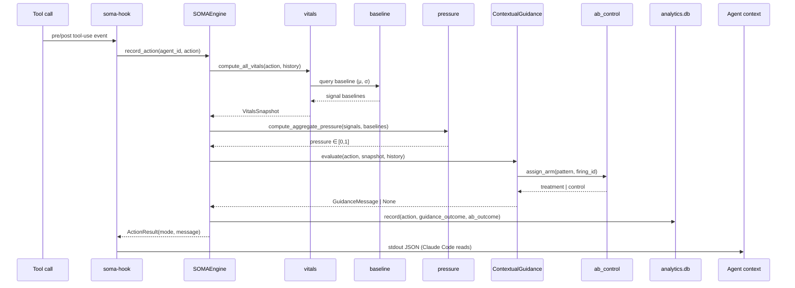

# Architecture

> The README explains *what* SOMA does. This document explains *how* — the layers, the dataflow, the design choices, the trade-offs, and what I deliberately didn't build.

---

## Where it lives

```
src/soma/
├── engine.py             ←  the orchestrator
├── types.py              ←  Action, VitalsSnapshot, AgentConfig, ResponseMode
├── errors.py             ←  SOMAError + subclasses
│
├── vitals.py             ←  five signals + sigmoid_clamp
├── baseline.py           ←  per-signal EMA with cold-start blending
├── pressure.py           ←  weighted-mean × max blend
├── guidance.py           ←  pressure → mode + destructive-op detection
├── contextual_guidance.py←  pattern engine (priority, cooldowns, healing)
│
├── ab_control.py         ←  block-randomized A/B harness
├── analytics.py          ←  SQLite outcomes store
├── persistence.py        ←  atomic JSON state I/O
├── recorder.py           ←  session replay capture
├── lessons.py            ←  cross-session error-pattern memory
│
├── budget.py             ←  multi-dimensional budget tracking
├── graph.py              ←  multi-agent pressure propagation graph
├── learning.py           ←  threshold adaptation from intervention outcomes
├── findings.py           ←  aggregate views over the above
│
├── wrap.py               ←  SDK-agnostic LLM client proxy
│
├── hooks/                ←  platform integrations (claude_code, cursor, windsurf)
│   ├── pre_tool_use.py
│   ├── post_tool_use.py
│   ├── stop.py
│   ├── statusline.py
│   └── …
│
├── cli/                  ←  `soma` command (init, status, dashboard, replay, …)
└── dashboard/            ←  FastAPI + SSE web dashboard
```

Fifty-six top-level modules. The entire core (vitals → pressure → guidance) has zero platform-specific imports — `hooks/` is the boundary.

---

## Runtime state

```
~/.soma/
├── analytics.db                 ←  SQLite. actions, guidance_outcomes, ab_outcomes
├── engine_state.json            ←  full engine snapshot (atomic write + flock)
├── ab_counters.json             ←  block-randomized counters per pattern
├── circuit_<agent_id>.json      ←  per-agent cooldowns, followthrough, signal pressures
├── lessons.json                 ←  cross-session error → fix recall
└── sessions/<session_id>/...    ←  replay traces
```

Everything is local files. No daemon, no background service, no external store. State survives process restart; concurrent `soma-hook` subprocesses coordinate through file locks.

---

## Dataflow

A single agent action takes the following path:



The whole path is synchronous, in-process, single-pass — no queue, no worker, no IPC. The hook subprocess is short-lived: it loads state, scores one action, writes state, prints a JSON envelope to stdout, and exits.

---

## Core types

All public types live in [`types.py`](../src/soma/types.py). Frozen dataclasses for value objects, mutable for config.

```python
@dataclass(frozen=True, slots=True)
class Action:
    tool_name: str
    output_text: str
    token_count: int = 0
    cost: float = 0.0
    error: bool = False
    retried: bool = False
    duration_sec: float = 0.0
    timestamp: float = 0.0
    metadata: dict[str, Any] = field(default_factory=dict)

@dataclass(frozen=True, slots=True)
class VitalsSnapshot:
    # Core five — used by pressure aggregation
    uncertainty: float = 0.0
    drift: float = 0.0
    error_rate: float = 0.0
    token_usage: float = 0.0
    cost: float = 0.0
    drift_mode: DriftMode = DriftMode.INFORMATIONAL
    # Plus context, calibration, and warmup-aware fields used by the
    # pattern engine — see types.py for the full surface.

class ResponseMode(Enum):
    OBSERVE = 0   # 0.00 – 0.25
    GUIDE   = 1   # 0.25 – 0.50
    WARN    = 2   # 0.50 – 0.75
    BLOCK   = 3   # 0.75 – 1.00
    # __lt__ / __le__ are defined manually so modes are
    # comparable without inheriting IntEnum semantics.
```

`Action` is the only thing the engine needs from the outside world. Everything downstream is computed from streams of `Action` plus per-agent configuration.

---

## The five subsystems

### 1. Vitals — what the agent looks like right now

Five signals, each in `[0, 1]`, computed in [`vitals.py`](../src/soma/vitals.py).

| Signal         | Source                                                  |
|----------------|---------------------------------------------------------|
| `uncertainty`  | hedge-token frequency in `output_text`, length-normalized |
| `drift`        | cosine distance from rolling intent vector              |
| `error_rate`   | `Σ is_error / window_size`, exponentially decayed       |
| `token_usage`  | `tokens / action`, normalized against per-agent baseline|
| `cost`         | `cost_usd / action`, normalized against per-agent baseline|

Each one is a small, pure function — no side effects, no I/O. The engine glues them together.

### 2. Baseline — what the agent normally looks like

Per-signal exponential moving average with cold-start blending in [`baseline.py`](../src/soma/baseline.py).

```
EMA update:
    μ_t   = α · current + (1 − α) · μ_{t−1}
    σ²_t  = α · (current − μ_{t−1})² + (1 − α) · σ²_{t−1}

Cold-start blend (first N observations):
    μ_blended = w · μ_t + (1 − w) · μ_default
    where w = min(1.0, n_observations / min_samples)
```

Without cold-start blending, the first three actions of any session would set the baseline — so a single `Bash` retry would look "normal" forever and never trigger anything. Cold-start says: until you've seen enough, trust the prior.

### 3. Pressure — collapsing five signals into one number

[`pressure.py`](../src/soma/pressure.py) does two things and that's it.

```python
def compute_signal_pressure(current, baseline, std):
    z = (current - baseline) / max(std, ε)
    return sigmoid_clamp(z)

def compute_aggregate_pressure(signal_pressures, weights):
    weighted_mean = Σ(w · p) / Σ(w)
    max_p         = max(signal_pressures)
    return 0.7 * weighted_mean + 0.3 * max_p
```

The shifted sigmoid (`1/(1 + e^(3−x))`, clamped 0/1) is the only place real numbers get squashed. Everything upstream stays linear and inspectable.

### 4. Pattern engine — turning pressure into guidance

[`contextual_guidance.py`](../src/soma/contextual_guidance.py) holds the priority dict, the per-pattern detectors, and the healing-transition lookup.

```python
_PATTERN_PRIORITY = {
    "cost_spiral":       10,
    "bash_error_streak":  6,
    "budget":             5,
    "bash_retry":         4,
    "error_cascade":      2,
    "blind_edit":         1,
}
```

Higher priority wins per action. Each fired pattern emits a `GuidanceMessage` carrying:

- `pattern` — key into priority table
- `severity` — one of `info | warn | crit`
- `text` — the actual message injected into agent context
- `evidence` — the action sequence that triggered it
- `healing_suggestion` — `(target_tool, expected_pressure_delta)`
- `cooldown_until` — Unix timestamp; persisted in `circuit_<agent>.json`

Cooldowns are file-persisted, not in-memory. This matters because every Claude Code tool event spawns a fresh `soma-hook` subprocess; in-memory state would reset between every action.

Healing-transition deltas come from [`analytics.py`](../src/soma/analytics.py) per agent when history exists, else fall back to:

```python
_HEALING_TRANSITIONS = {
    "Bash":  ("Read", "Bash→Read reduces pressure by 7%"),
    "Edit":  ("Read", "Edit→Read reduces pressure by 5%"),
    "Write": ("Grep", "Write→Grep reduces pressure by 5%"),
}
```

The dict is loaded lazily through `_HEALING_CACHE` and refreshed when the analytics store is updated.

### 5. Persistence — surviving 50 ms

The hook runtime is hostile: every Claude Code action invokes a fresh Python subprocess. State must survive process exit.

[`persistence.py`](../src/soma/persistence.py) does **atomic JSON writes** under `flock`:

```
1.  fd = open(path + ".lock", flags=O_CREAT)
2.  fcntl.flock(fd, LOCK_EX)
3.  write to path + ".tmp"
4.  fsync(tmp)
5.  os.replace(tmp, path)             ← atomic rename
6.  fcntl.flock(fd, LOCK_UN)
```

[`analytics.py`](../src/soma/analytics.py) sets `synchronous=NORMAL`, `busy_timeout=5000`, and `journal_mode=WAL` on the SQLite connection. WAL gives concurrent readers + a single writer with non-blocking writes; the busy_timeout absorbs the rare write contention from overlapping `soma-hook` subprocesses.

[`ab_control.py`](../src/soma/ab_control.py) layers an extra safeguard: the `ab_counters.json` file is written through both `flock` *and* the atomic `tmp + fsync + os.replace` sequence, because A/B counter corruption silently biases the experiment.

---

## Concurrency model

```
              ┌──────────────────────┐
              │   Claude Code        │
              │   (tool invocation)  │
              └──────────┬───────────┘
                         │ spawns
                         ▼
              ┌──────────────────────┐
              │  soma-hook (subproc) │   ← fresh Python process
              │                      │     every single tool call
              │  reads state files   │
              │  computes vitals     │
              │  evaluates patterns  │
              │  writes back state   │
              │  prints JSON stdout  │
              └──────────────────────┘
```

Concurrent invocations are real — multiple Claude Code agents in different windows hit the same `~/.soma/` directory. Coordination is file-based:

- **JSON state** → `flock` + atomic `tmp + fsync + replace`
- **SQLite analytics** → WAL + `busy_timeout=5000`
- **A/B counters** → both of the above, layered

There is no daemon, no shared memory, no IPC primitive beyond the kernel's filesystem locks. This was a deliberate choice: SOMA must work the moment `pip install soma-ai && soma init` finishes, without asking the user to start a service.

---

## Two integration paths

|                          | Hooks                                          | SDK wrap (`soma.wrap`)                  |
|:-------------------------|:-----------------------------------------------|:----------------------------------------|
| **Where it runs**        | `soma-hook` subprocess per tool call           | In-process, inside the agent runtime    |
| **Activation**           | `.claude/settings.json` `PreToolUse`/`PostToolUse` hooks | `client = soma.wrap(client)`            |
| **Granularity**          | Per tool call                                  | Per LLM API call                        |
| **State**                | File-based (`~/.soma/`)                        | In-process (and optionally file-backed) |
| **Per-event cost**       | one Python subprocess startup + state I/O      | in-process function call (no fork)      |
| **Provider coupling**    | Claude Code today (Cursor/Windsurf scaffolded) | Any client with `.messages.create(…)`   |
| **Fits**                 | Tool-using agents (Claude Code, Cursor, …)     | Library/SDK consumers, programmatic agents |

The hook path is the primary integration today because that's where the tightest feedback loop is — `PreToolUse` can change context, `PostToolUse` can record outcomes.

The SDK wrap path is provider-agnostic but observes only what passes through the LLM client: it sees prompts and completions, not arbitrary tool calls.

---

## Design decisions

### Why a blended mean+max, not just mean

A single screaming signal (cost spiking 10×) shouldn't be lost in an average with four calm ones. Pure max, on the other hand, makes one noisy sensor dictate the whole agent's mode. The 70/30 blend gives mean priority while letting any one signal pull the result up. The constant is global today; per-agent learned weights are on the roadmap.

### Why a sigmoid shifted by 3, not centred at 0

A z-score of 0 means "exactly average" — that should be `signal_pressure ≈ 0`, not `0.5`. The shift puts the inflection point at `z = 3`, so a signal must be three standard deviations above its baseline before the corresponding signal pressure crosses 0.5. The hard clamps (`x ≤ 0 → 0`, `x > 6 → 1`) skip the asymptotic tails entirely and keep the math cheap.

### Why per-firing A/B randomization, not per-session

If the assignment is per-session, every action in the session gets the same arm. A single agent in a long session can dominate one arm's outcome distribution. Per-firing assignment, keyed on a UUID `firing_id`, treats each pattern firing as an independent trial. This is what lets `n=30` mean something on a system that runs across only a few hundred sessions.

### Why SQLite, not Postgres or an event store

SQLite has no service, no schema migration tool dependency, no network. WAL mode + a 5-second `busy_timeout` is enough concurrency for the hook subprocess load. The file is one user's behavioural history — there is no need to scale beyond that. If the user wants to ship outcomes elsewhere, the OTLP exporter at `pip install soma-ai[otel]` does that.

### Why hooks first, OTLP later

Hooks let SOMA actually *change* what the agent does next. OTLP only emits — it tells someone else what already happened. The first version had to demonstrate the closed loop, so the hook integration came first. OTLP export is bolted on as an optional extra, not the primary surface.

### Why kill patterns instead of accumulating them

Empirically, a high-volume pattern with a weak helped-rate masks the patterns underneath it in the agent's attention budget. The agent doesn't read every guidance message equally — fatigue is real. Removing `_stats` (the highest-firing pattern in v2026.5.0) measurably improved the helped-rate of every other pattern below it.

---

## What I deliberately didn't build

- **No prompt rewriting.** SOMA observes and guides; it does not silently modify the agent's outputs. Guidance is additive context, never a substitution.
- **No sandbox.** The agent's tool execution still runs in whatever environment the host (Claude Code, Cursor) provides. SOMA decides whether to *refuse* an op above pressure 0.75 — it does not contain the side-effects of an op it allowed.
- **No central server.** Every agent's data lives in the user's `~/.soma/`. There is no telemetry endpoint receiving anything by default.
- **No learned thresholds yet.** Calibration is per-agent EMA. RL or fine-tuned thresholding is on the roadmap; the current system is heuristic plus light statistics.

---

<sub>For the headline view, see [README](../README.md). For change history, see [CHANGELOG](../CHANGELOG.md).</sub>
